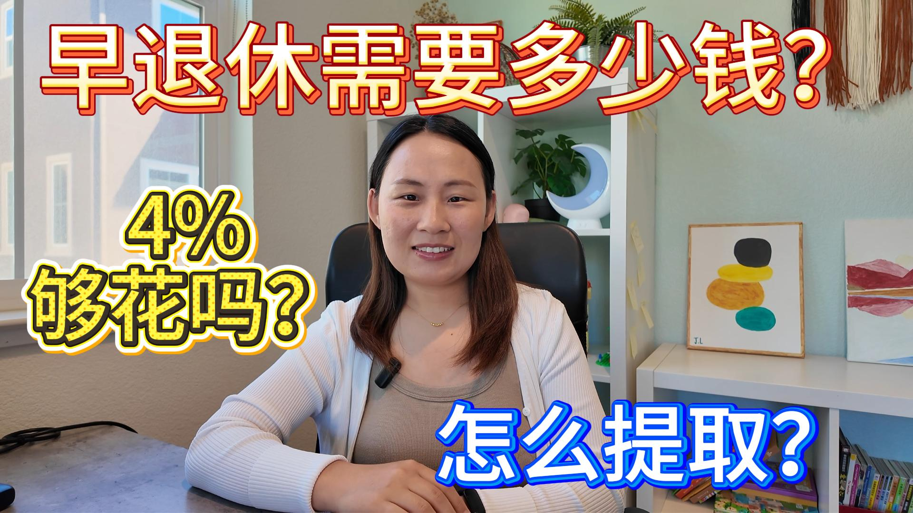

# Creator Publish Package

[中文](#中文) · [English](#english)

## 中文

Creator Publish Package 是一个面向视频创作者的 ChatGPT Plugin。它内置同名 Skill：提供一份视频脚本和一张干净的基础封面，再选择 YouTube、Bilibili 和 REDnote（小红书）中的任意平台组合，它会为所选平台分别生成平台原生的标题、简介或正文、标签与封面。

它不会简单复制或翻译同一套内容：YouTube 偏重好奇心与观看收益，Bilibili 偏重清晰度与信息密度，REDnote 偏重个人经历与实用价值。

### 输入

- `script.md` 或可访问的 Notion 页面
- `cover.png`
- 可选的 `Platforms`；未填写时默认生成全部三个平台

### 调用示例

```text
Create a publish package from:
Script: ./script.md
Cover: ./cover.png
Platforms: YouTube, REDnote
```

`Platforms` 可以是一个、两个或三个平台，例如只生成 YouTube，或生成 YouTube + Bilibili。

默认情况下，Skill 会先给出每个所选平台的标题与封面文字选项，等你确认后再生成封面。如果希望跳过确认，可以添加：

```text
Auto choose the strongest title and cover text for each platform.
```

### 输出

输出始终包含 `publish.md`，并且只包含所选平台的封面。例如选择 YouTube 和 REDnote 时：

```text
publish-package/
├── publish.md
├── youtube.png
└── rednote.png
```

- `publish.md`：所选平台可直接复制的标题、备选标题、简介或正文、封面文字和标签
- `youtube.png`：1280 × 720，16:9
- `bilibili.png`：1280 × 720，兼顾中央 4:3 裁切
- `rednote.png`：1080 × 1440，3:4 竖屏

选择 YouTube 时，其简介和标签默认提供中英文双语版本。若基础封面包含真人，Skill 会尽量在所有所选平台复用同一份人物抠图，保留人物外貌、衣服、姿势及原始环境，并针对各平台重新排版背景与文字。

## English

Creator Publish Package is a ChatGPT Plugin for video creators. It includes the Creator Publish Package Skill. Provide one video script, one clean base cover image, and any combination of YouTube, Bilibili, and REDnote. It creates platform-native titles, descriptions or posts, tags, and covers only for the selected platforms.

It does not simply copy or translate one package. YouTube emphasizes curiosity and viewer payoff, Bilibili emphasizes clarity and information density, and REDnote emphasizes personal experience and practical value.

### Inputs

- `script.md` or an accessible Notion page
- `cover.png`
- Optional `Platforms`; all three platforms are generated when omitted

### Example

```text
Create a publish package from:
Script: ./script.md
Cover: ./cover.png
Platforms: YouTube, REDnote
```

`Platforms` may contain one, two, or all three supported platforms—for example, YouTube only or YouTube + Bilibili.

By default, the Skill proposes title and cover-text options for each selected platform before generating the covers. To skip approval, add:

```text
Auto choose the strongest title and cover text for each platform.
```

### Output

The output always includes `publish.md` and includes cover files only for the selected platforms. For example, when YouTube and REDnote are selected:

```text
publish-package/
├── publish.md
├── youtube.png
└── rednote.png
```

- `publish.md`: copy-ready titles, alternatives, descriptions or posts, cover text, and tags for the selected platforms
- `youtube.png`: 1280 × 720, 16:9
- `bilibili.png`: 1280 × 720, safe for a centered 4:3 crop
- `rednote.png`: 1080 × 1440, native 3:4 vertical layout

When YouTube is selected, its descriptions and tags are bilingual in Chinese and English by default. When the base cover contains a real person, the Skill aims to reuse one consistent portrait across all selected platforms while preserving identity, clothing, pose, and recognizable parts of the original environment.

## Before & After / 效果对比

| Before / 使用前 | After / 使用后 |
|---|---|
|  |  |

同一张人物封面经过 Creator Publish Package 重新包装后，标题层级更清楚，人物保持一致，并加入了与主题相关的辅助视觉。

Using the same creator image, Creator Publish Package improves headline hierarchy, preserves the creator, and adds a topic-relevant supporting visual.
